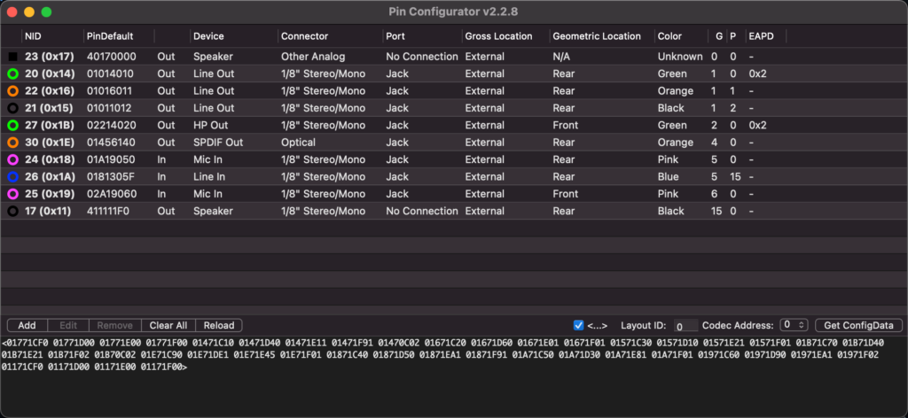

# 用AppleALC定制声卡记录

参考教程： 

https://blog.qqccy.cn/172.html

https://blog.csdn.net/huangmindong/article/details/74931821

https://www.jianshu.com/p/f6b8bc6e69ea

http://tsomac.blogspot.com/2012/11/applehda-alc269-for-lenovo-s10.html

https://github.com/acidanthera/AppleALC/tree/master/Tools

https://github.com/btwise/TOOLS/tree/master/AppleALC

https://github.com/cmatsuoka/codecgraph

https://blog.daliansky.net/Use-AppleALC-sound-card-to-drive-the-correct-posture-of-AppleHDA.html

https://www.jianshu.com/p/23691012b358

[https://lioliy.gitlab.io/2019/12/17/applealc%E5%A3%B0%E5%8D%A1%E8%87%AA%E5%AE%9A%E6%8C%87%E5%8D%97/#%E7%BC%96%E8%BE%91%E4%BB%A5%E7%94%9F%E6%88%90configdata](https://lioliy.gitlab.io/2019/12/17/applealc声卡自定指南/#编辑以生成configdata)

# 前期准备

- 下载`Xcode`

```
https://apps.apple.com/cn/app/xcode/id497799835?mt=12
```

- 下载`AppleALC`

```
https://github.com/vit9696/AppleALC
```

- 下载`Lilu`

```
https://github.com/acidanthera/Lilu
```

- 下载`PinConfigurator`

```
https://github.com/headkaze/PinConfigurator
```

- 下载`codecgraph`

```
https://github.com/cmatsuoka/codecgraph
```

- 下载`MacKernelSDK`

```
https://github.com/acidanthera/MacKernelSDK
```

- 提取`Codec`这一步需要用到`Linux`环境，首先下载`Ubuntu` ISO，下载好镜像之后，将U盘格式化为`Fat32`，然后将镜像解压到U盘，重启以U盘启动，选择试用进入`Ubuntu`系统界面，打开终端

```
cd ~/Desktop/ # 进入桌面
cp /proc/asound/card0/codec* ./card0   #将card0下codec开头文件拷贝到card0文件夹
cp /proc/asound/card1/codec* ./card1   #将card1下codec开头的文件拷贝到card1文件夹
sudo cp -R /sys/firmware/acpi/tables .    #将acpi/tables目录复制到当时位置,tables目录包括了全部的DSDT和SSDT
sudo chown -R ubuntu:ubuntu *     #将当前目录下所有文件及目录所有人修改为ubuntu
```

**PS: 带HDMI的一般声卡会有两个一个是card0，一个是card1，我的声卡就是在card1下，也可以手动进入`/proc/asound/`目录查看，直接拷贝出来也行。**

# codec.txt 的数据整理

### **打开PinConfigurator，导入刚才获取的codec.txt**



### **修正节点**


```
Node ID：即节点ID，不需要更改
PinDefault：根据下面的选项生成，如果你知道每位数字代表什么也可以直接填写
Device：设备类型（根据实际情况选择）（影响PinDefault第3位）
Connector：连接类型（内建为ATAPI Internal，耳机为HP OUT，其他外接根据实际情况设置）（影响PinDefault第4位）
Port：端口类型（内建Fixed，外接Jack）（与Gross Location共同影响PinDefault第1位）
Gross Location：位置（内建Internal，外接External）
Geo Location：插孔位置（根据情况设置）（影响PinDefault第2位）
Color：插孔颜色（根据实际情况设置，一般不用更改）（影响PinDefault第5位）
Misc：配置（内建为Jack Detect Override，外接不选，一定要注意选择一个或不选，每个节点都要打开确认一下，不要选中其他的）（影响PinDefault第6位）
Group：分组顺序，多声道可以设置为同一组，就是这里是同一个数字。（即Default Association，影响PinDefault第7位）
Position：同组设备优先级，一般设置为0即可，多声道需要分别设定，
后左与后右设置为1，中央与重低音设置为2，前左与前右声道设置为3。（即Sequence，影响PinDefault第8位）
EAPD：EAPD放大器（不要修改）
```

### **获取ConfigData**

使用**PinConfigurator**编辑节点完成后，点击获取ConfigData，拷贝下方显示数据备用，形式如下：

```
<01471C10 01471D40 01471E11 01471F91 01470C02 01671C20 01671D60 01671E01 01671F01 01571C30 01571D10 01571E21 01571F01 01B71C70 01B71D40 01B71E21 01B71F02 01B70C02 01E71C90 01E71DE1 01E71E45 01E71F01 01871C40 01871D50 01871EA1 01871F91 01A71C50 01A71D30 01A71E81 01A71F01 01971C60 01971D90 01971EA1 01971F02 01171CF0 01171D00 01171E00 01171F00 01771CF0 01771D00 01771E00 01771F00>
```

### **导出verbs.txt节点文件**


```
Verbs from File: "Codec.txt"

Codec: Realtek ALCS1200A   Address: 0   DevID: 283904768 (0x10EC0B00)

NID       PinDefault     Device             Connector           Port            Location                    Color     G  P  EAPD  Original Verbs
------------------------------------------------------------------------------------------------------------------------------------------------
17 (0x11) 411111F0   Out Speaker            1/8" Stereo/Mono    No Connection   External Rear               Black     15 0  -     01171CF0 01171D11 01171E11 01171F41
20 (0x14) 01014010   Out Line Out           1/8" Stereo/Mono    Jack            External Rear               Green     1  0  0x2   01471C10 01471D40 01471E01 01471F01 01470C02
21 (0x15) 01011012   Out Line Out           1/8" Stereo/Mono    Jack            External Rear               Black     1  2  -     01571C12 01571D10 01571E01 01571F01
22 (0x16) 01016011   Out Line Out           1/8" Stereo/Mono    Jack            External Rear               Orange    1  1  -     01671C11 01671D60 01671E01 01671F01
23 (0x17) 40170000   Out Speaker            Other Analog        No Connection   External N/A                Unknown   0  0  -     01771C00 01771D00 01771E17 01771F40
24 (0x18) 01A19050   In  Mic In             1/8" Stereo/Mono    Jack            External Rear               Pink      5  0  -     01871C50 01871D90 01871EA1 01871F01
25 (0x19) 02A19060   In  Mic In             1/8" Stereo/Mono    Jack            External Front              Pink      6  0  -     01971C60 01971D90 01971EA1 01971F02
26 (0x1A) 0181305F   In  Line In            1/8" Stereo/Mono    Jack            External Rear               Blue      5  15 -     01A71C5F 01A71D30 01A71E81 01A71F01
27 (0x1B) 02214020   Out HP Out             1/8" Stereo/Mono    Jack            External Front              Green     2  0  0x2   01B71C20 01B71D40 01B71E21 01B71F02 01B70C02
30 (0x1E) 01456140   Out SPDIF Out          Optical             Jack            External Rear               Orange    4  0  -     01E71C40 01E71D61 01E71E45 01E71F01
------------------------------------------------------------------------------------------------------------------------------------------------


NID       PinDefault     Device             Connector           Port            Location                    Color     G  P  EAPD  Modified Verbs
------------------------------------------------------------------------------------------------------------------------------------------------
23 (0x17) 40170000   Out Speaker            Other Analog        No Connection   External N/A                Unknown   0  0  -     01771C00 01771D00 01771E17 01771F40
20 (0x14) 01014010   Out Line Out           1/8" Stereo/Mono    Jack            External Rear               Green     1  0  0x2   01471C10 01471D40 01471E01 01471F01 01470C02
22 (0x16) 01016011   Out Line Out           1/8" Stereo/Mono    Jack            External Rear               Orange    1  1  -     01671C11 01671D60 01671E01 01671F01
21 (0x15) 01011012   Out Line Out           1/8" Stereo/Mono    Jack            External Rear               Black     1  2  -     01571C12 01571D10 01571E01 01571F01
27 (0x1B) 02214020   Out HP Out             1/8" Stereo/Mono    Jack            External Front              Green     2  0  0x2   01B71C20 01B71D40 01B71E21 01B71F02 01B70C02
30 (0x1E) 01456140   Out SPDIF Out          Optical             Jack            External Rear               Orange    4  0  -     01E71C40 01E71D61 01E71E45 01E71F01
24 (0x18) 01A19050   In  Mic In             1/8" Stereo/Mono    Jack            External Rear               Pink      5  0  -     01871C50 01871D90 01871EA1 01871F01
26 (0x1A) 0181305F   In  Line In            1/8" Stereo/Mono    Jack            External Rear               Blue      5  15 -     01A71C5F 01A71D30 01A71E81 01A71F01
25 (0x19) 02A19060   In  Mic In             1/8" Stereo/Mono    Jack            External Front              Pink      6  0  -     01971C60 01971D90 01971EA1 01971F02
17 (0x11) 411111F0   Out Speaker            1/8" Stereo/Mono    No Connection   External Rear               Black     15 0  -     01171CF0 01171D11 01171E11 01171F41
------------------------------------------------------------------------------------------------------------------------------------------------
```

> 记录 DevID: 283904768 备用

### **使用codecgraph生成pathmap图**

```
./codecgraph Codec.txt
```

> 生成一个名为Codec.txt.svg的文件，可以使用浏览器或者专门的流程图app打开，比如Skecth


### **根据pathmap图**整理路径

| 有效节点 | 10进制 | 设备名称     | 路径                 |
| -------- | ------ | ------------ | -------------------- |
| 0x14     | 20     | Speaker out  | 21->13->3            |
| 0x15     | 21     | Line Out     | 22->14->4            |
| 0x16     | 22     | Line Out     | 20->12->2            |
| 0x1B     | 27     | HP Out       | 27->15->5            |
| 0x1E     | 30     | SPDIF Out    | 30->6                |
| 0x18     | 24     | Rear Mic in  | 8>35->24             |
| 0x19     | 25     | Front Mic in | 9>34->25             |
| 0x1a     | 26     | Line in      | 8>35->26 or 9>34->26 |

> 这里路径要转换成十进制，也可以使用脚本将pathmap转换成十进制，`./convert_hex_to_dec.rb codec_dump.txt.svg > codec_dump_dec.txt.svg`

**至此，Codec 数据的整理到此结束**

# 开始定制

打开下载的`AppleALC`源码

将下载的`Debug`的`Lilu.kext`放进 AppleALC 源码根目录；

删除`/AppleALC/Resources`中多余文件夹，只留下你的声卡型号文件夹、`Pinconfigs.kext`以及四个`plist`文件，我的声卡是ALCS1200A，如下图


依次编辑

```
/AppleALC/Resources/PinConfigs.kext/Contents`/`Info.plist
/AppleALC/Resources/ALCS1200A`/`Info.plist
/AppleALC/Resources/ALCS1200A`/`layout31.xml
/AppleALC/Resources/ALCS1200A`/`Platforms31.xml
```

> 这里的layout31.xml和Platforms31.xml是根据自定义的id取的名字，你也可以使用其他数字，虽然非要一致才可，但为了方便最好跟你自定义的id一致，免得去思考对应关系。这里layout31.xml和Platforms31.xml用声卡下现有的文件直接改名即可。

### 编辑`/AppleALC/Resources/PinConfigs.kext/Contents`/`Info.plist`


CodecID 填写前面获取的DevID: 283904768

ConfigData填上面修正后获取到的ConfigData

LayoutID 填写你自定义的id，我选择的是31

WakeConfigData填EAPD节点+70C02，比如我有两个带EAPD的节点，分别是0x14，0x1B

### 编辑`/AppleALC/Resources/ALCS1200A/Info.plist`


id和path对应你的文件名和id填写即可。这里就是关联路径，告诉驱动去layout31.xml去找布局，去Platforms31.xml去找平台。

### 编辑`layout31.xml`


就这3个地方要改，前面两个都知道咋个改了，PathMapID数字自己随便填，跟Platforms31.xml中的对应即可。

### 编辑`Platforms31.xml`


| 第一级序号 | **第二级序号** | 设备名称     | 节点 | 路径                   |
| :--------: | :------------: | ------------ | :--: | ---------------------- |
|     0      |       0        | Rear Mic in  | 0x18 | 8->35->24              |
|     0      |       1        | Front Mic in | 0x19 | 9->34->25              |
|     1      |       0        | Line in      | 0x1a | 8->35->26 或 9->34->26 |
|     2      |       0        | Speaker out  | 0x14 | 20->12->2              |
|     2      |       1        | HP Out       | 0x1B | 27->15->5              |
|     3      |       0        | Line Out     | 0x16 | 22->14->4              |
|     4      |       0        | Line Out     | 0x15 | 21->13->3              |
|     5      |       0        | SPDIF Out    | 0x1E | 30->6                  |

> 这里两个麦克风，前面板和后面板的两个音频输出均在同一组，意思就是一个插上另一个就自动停止输入或输出。

**至此， AppleALC 驱动声卡部分结束。**

# 编译

1.将Lilu.kext的debug版本拷贝到AppleALC根目录

2.将MacKernelSDK拷贝到AppleALC根目录

3.在 Xcode 的项目配置中**添加用户定义的设置**，添加`KERNEL_EXTENSION_HEADER_SEARCH_PATHS`和`KERNEL_FRAMEWORK_HEADERS`值。

```
KERNEL_EXTENSION_HEADER_SEARCH_PATHS = $(PROJECT_DIR)/MacKernelSDK/Headers
KERNEL_FRAMEWORK_HEADERS = $(PROJECT_DIR)/MacKernelSDK/Headers
```

对于编译AppleALC，这步可以省略，AppleALC工程文件里已经设定了。

4.双击打开AppleALC文件夹中的AppleALC.xcodeproj，在Xcode中点击Product -> Archive

5.选中applealc点右侧的export，在出现的对话框中点save built products ->next，保存即可

# 测试

将AppleALC.kext拷贝到 EFI/OC/Kexts中,并在info.plist中启用，重启检查。
